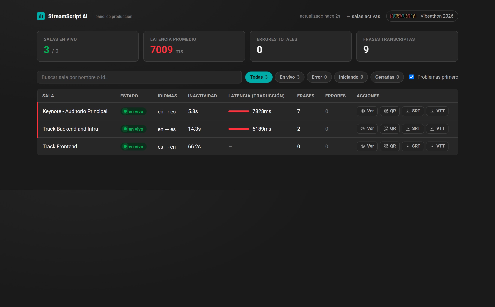
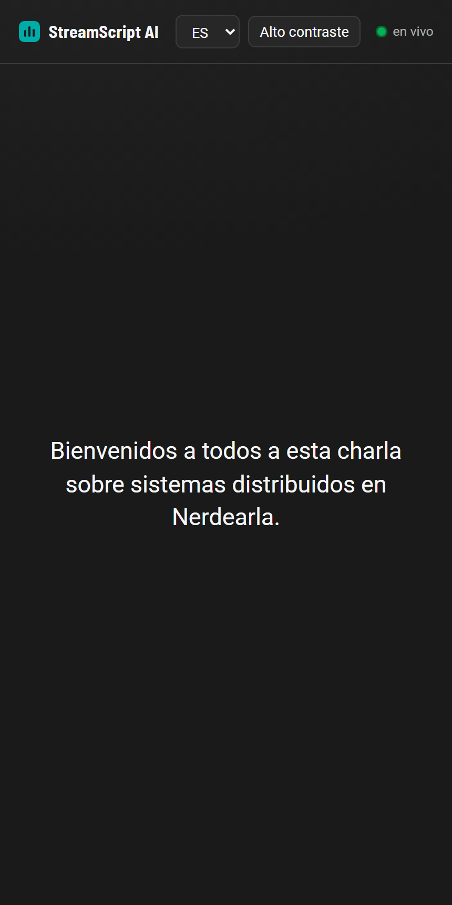
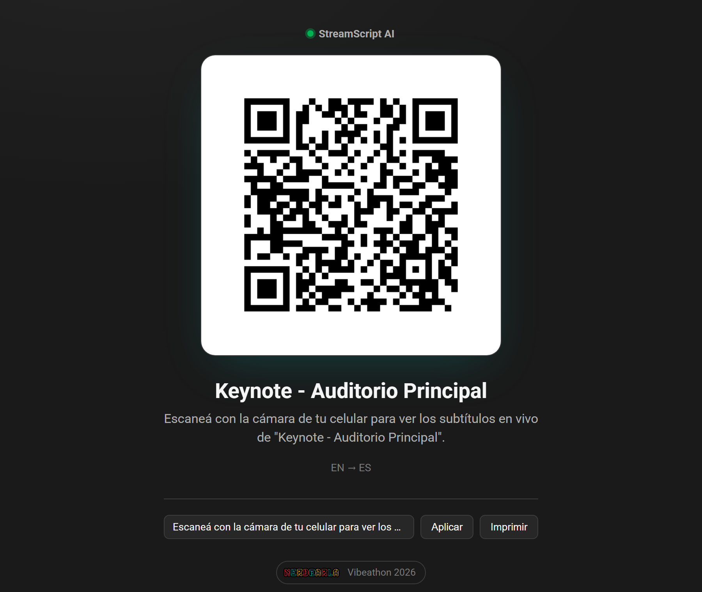
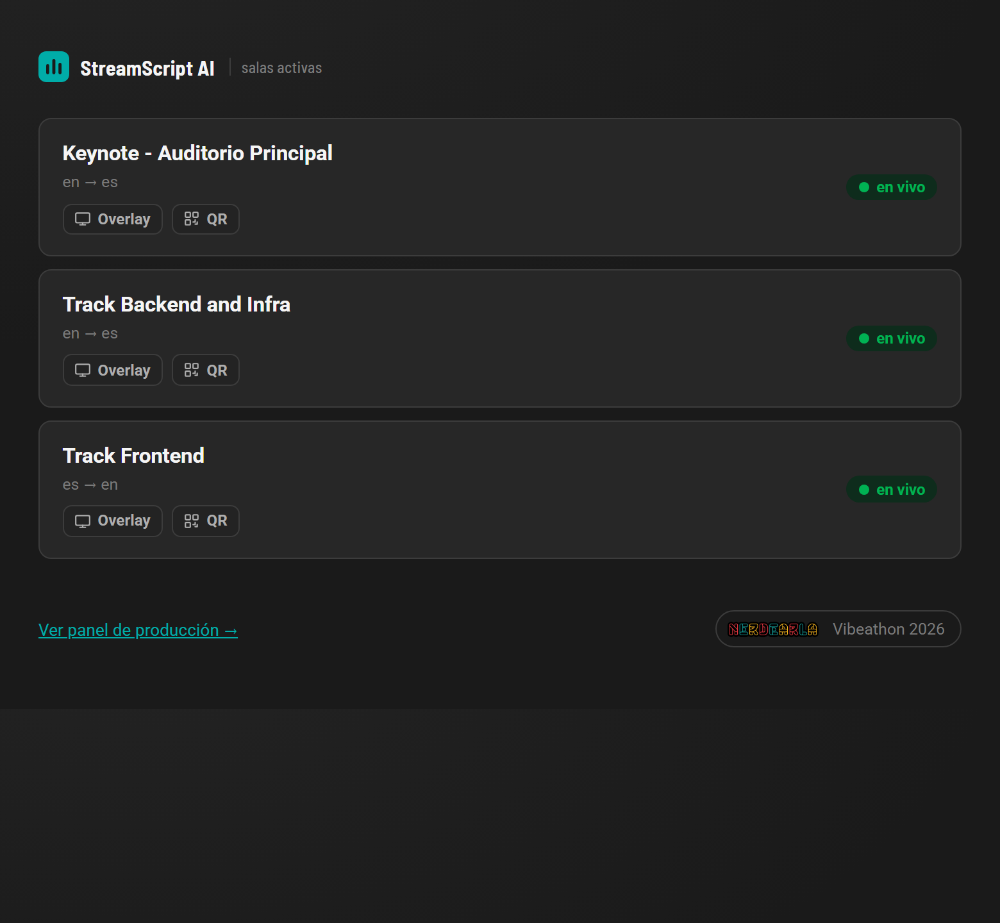

# StreamScript AI

Subtítulos y traducción en tiempo real para conferencias, open source y a escala de producción.

[](https://github.com/LaliPerez/streamscript-ai/actions/workflows/ci.yml)
[](LICENSE)
[](https://ai.google.dev)
[](docker-compose.yml)
[](https://nerdearla.com)

Construido para la **Vibeathon de Nerdearla 2026**: reemplazar el esquema actual de subtitulado
comercial/manual (caro, dependiente de operadores, no replicable) por un motor open source que
cualquier conferencia pueda desplegar con `docker compose up`.

**Lo que distingue a esta entrega:** cada afirmación técnica de este README se probó contra la API real
de Gemini durante el desarrollo, no solo contra el `MockProvider` incluido — incluyendo los momentos en
que la API no se comportó como decía la documentación. Eso significa encontrar y resolver en vivo que
ningún modelo Live "conversacional" de Gemini acepta audio+texto (obligó a rediseñar la arquitectura en
dos etapas), que el free tier tiene cuotas de apenas 20 requests/día en algunos modelos, y validar con
**audio real** — no texto de prueba — las cuatro combinaciones de idioma que pide el reto, incluyendo
portugués de punta a punta. El detalle de cada prueba está en
[Fortalezas de la arquitectura](#fortalezas-de-la-arquitectura) y en el checklist de abajo.

<p align="center">
  
</p>
<p align="center">
  
  
  
</p>
<p align="center"><sub>Capturas reales del sistema corriendo contra la API de Gemini, no mockups.</sub></p>

## Checklist del desafío, con evidencia

Requisitos obligatorios de la Vibeathon, cada uno con lo que lo respalda:

- [x] **Transcripción en tiempo real, idioma original + español.** Validado con audio real en inglés y
      portugués, transcripto correctamente por `gemini-3.5-transcribe-live`.
- [x] **Traducción español → inglés ("si podés").** Validado con voz en español real (TTS de Windows):
      *"Bienvenidos a esta charla sobre sistemas distribuidos."* → *"Welcome to this talk about
      distributed systems."*
- [x] **Correr varias sesiones al mismo tiempo (5, 10+).** La arquitectura lo soporta y se probó con
      hasta 8 salas `GeminiLiveProvider` reales en simultáneo sin interferencia entre las que conectaron.
      El techo real hoy es de **cuota de cuenta de Google (tier gratuito), no de la arquitectura** — ver
      [la sección de cuota](#cuota-de-la-cuenta-no-límite-de-la-arquitectura-leer-antes-de-un-evento-real),
      es lo primero a resolver antes de un evento real.
- [x] **Licencia OSI + documentación clara.** MIT (aprobada por OSI) — ver [LICENSE](LICENSE).
- [x] **Vista de audiencia: elegir sesión e idioma.** `index.html` lista las salas activas (elegir
      sesión), `watch.html` tiene el selector de idioma — validado abriéndolo en el navegador.
- [x] **Construida sobre Gemini.** `GeminiLiveProvider`, arquitectura en dos etapas (necesaria: ningún
      modelo Live "conversacional" acepta `response_modalities=["TEXT"]` con audio a esta fecha):
      1. **ASR en streaming** con `gemini-3.5-transcribe-live`, detectando fin de oración por puntuación
         sobre el transcript acumulado que devuelve el modelo.
      2. **Traducción por oración** con una llamada de texto aparte (configurable con
         `GEMINI_TRANSLATE_MODEL`), inyectando el glosario técnico en el prompt — confirmado que respeta
         términos marcados como "no traducir" (ej. *hydration*). Si esa llamada falla (rate limit, 503),
         degrada a mostrar el texto sin traducir en vez de perder el subtítulo, y **eso queda registrado**
         como error visible en `/dashboard.html`, no oculto.
- [ ] **Proveedor local con Gemma para el caso 100% offline.** Gemma en sí **no transcribe audio** (es
      una familia de modelos de texto); el camino equivalente al de arriba sería un ASR local (ej.
      Whisper) + **TranslateGemma** (variante de Gemma para traducción, 55 idiomas) — mismo contrato
      `TranscriptionProvider`, mismo patrón de dos etapas ya validado con Gemini.

Opcionales cubiertos — los 5 del reto: glosario técnico, export SRT/VTT/TXT, overlay OBS/vMix, portugués
como idioma extra (entrada y salida, validado con audio real), y panel de monitoreo con latencia y
errores reales por sala (no estimados).

Pendiente: escalado horizontal (Redis-backed `RoomManager` + workers separados) para producción a 30+
salas más allá de un solo proceso — no bloqueante para el reto, sí sería el siguiente paso real.

## El problema

Nerdearla y conferencias similares dependen de la transcripción y traducción simultánea para ser
accesibles a toda su audiencia. Hoy eso se resuelve con herramientas comerciales que cobran por
minuto por canal activo, requieren operación humana constante, y no son reutilizables por otras
comunidades por costo y licenciamiento. Con 30+ sesiones simultáneas, ese esquema no escala.

## La solución

Una plataforma que toma audio en vivo de N salas en paralelo y produce, por sala:
- Transcripción en el idioma original.
- Traducción a español (y opcionalmente de español a inglés/portugués).
- Vista pública para la audiencia (QR + selector de idioma), export SRT/VTT/TXT al cerrar la sala,
  panel de monitoreo para el equipo de producción, y una vista lista para incrustar como overlay en
  OBS/vMix.

Corre sobre las capacidades de audio en vivo de **Gemini** (`google-genai`, Live API); la lógica de
transcripción está detrás de una interfaz (`TranscriptionProvider`) para poder sumar un proveedor 100%
local basado en **Gemma** sin tocar el resto del sistema.

## Arquitectura

```
mic_client.py ──WS(audio)──▶ /ws/ingest/{room}
                                    │
                              RoomManager (in-memory)
                                    │
                        worker.py — 1 asyncio task por sala activa
                                    │
                    GeminiLiveProvider (TranscriptionProvider)
                      1. ASR streaming (gemini-3.5-transcribe-live),
                         detecta fin de oración por puntuación
                      2. Traducción por oración (llamada de texto
                         aparte + glosario en el prompt)
                      — reconecta antes del límite de ~15min/sesión —
                                    │
                    transcript_store.py (buffer + persistencia JSONL)
                                    │
                              ws_hub.py (pub/sub por sala)
                       ┌────────────┼────────────┐
                 /watch/{id}   /overlay/{id}   /dashboard
                 (audiencia)    (OBS/vMix)     (producción,
                                                 latencia + errores)
                                    │
                        export.py → .srt / .vtt / .txt
```

Un solo proceso FastAPI corre varias salas en paralelo como tasks de asyncio (I/O-bound, escala bien
para una demo con varias salas simultáneas). Para producción real a 30+ salas, el mismo `RoomManager`
se puede respaldar en Redis y correr varios workers horizontales con pub/sub para el fan-out — no
necesario para probar el concepto, sí documentado como el siguiente paso.

## Decisiones de arquitectura (y por qué)

Cada decisión de abajo tuvo una alternativa más obvia que se descartó a propósito. El criterio general
fue: priorizar lo que reduce fricción para que **cualquier conferencia lo pueda adoptar**, y lo que
reduce el radio de impacto de lo que todavía no sabíamos sobre la API de Gemini al empezar.

- **¿Por qué Gemini/Google AI y no OpenAI (Whisper) + otro proveedor para traducir?** El reto lo pide
  explícitamente ("te recomendamos construirla sobre las capacidades de audio de Gemini"), pero además
  es la opción técnicamente más directa: `gemini-3.5-transcribe-live` es un modelo dedicado a ASR en
  streaming de baja latencia con soporte a 85+ idiomas vía WebSocket — no hay que armar un pipeline
  propio de VAD + chunking + llamadas batch a un modelo de transcripción no pensado para tiempo real.
  Usar el mismo proveedor para ASR y para traducción también simplifica la integración: un solo SDK, una
  sola autenticación, un solo lugar donde vive la lógica de reintentos — en vez de coordinar dos
  proveedores con comportamientos y límites de cuota distintos.

- **¿Por qué Gemma (vía TranslateGemma) para el camino 100% local, y no Llama o Mistral?** También lo
  sugiere el reto, pero la razón técnica es que **Gemma tiene una variante dedicada a traducción**
  (TranslateGemma, 55 idiomas) que encaja exacto en la segunda etapa que ya existe (traducción por
  oración, llamada de texto separada) sin rediseñar nada — solo hay que escribir un
  `GemmaLocalProvider` que implemente el mismo contrato. Ser la misma familia de modelos que Gemini
  (ambos de Google) también significa reusar la misma forma de pensar los prompts en vez de aprender el
  comportamiento de un ecosistema distinto. La transcripción en ese camino local no la hace Gemma (no
  transcribe audio) sino un ASR local aparte (ej. Whisper) — ver el ítem del roadmap.

- **¿Por qué la arquitectura en dos etapas (ASR + traducción separada), en vez de un solo modelo Live
  conversacional?** No fue la primera opción: se intentó primero pedirle a un modelo Live "de chat" que
  transcriba y traduzca en un solo llamado. La API real lo rechazó (ningún modelo Live conversacional
  acepta `response_modalities=["TEXT"]` con audio de entrada, confirmado contra la API). El pivot a dos
  etapas resultó, de yapa, en algo más robusto: cada etapa se puede reintentar, cachear o reemplazar por
  separado (una traducción que falla degrada a texto sin traducir en vez de tirar abajo la transcripción).

- **¿Por qué un solo proceso con asyncio para multi-sala, en vez de arrancar con colas/microservicios?**
  La carga es I/O-bound (esperar respuestas de red de Gemini), no CPU-bound, así que asyncio de por sí
  ya soporta bien decenas de sesiones concurrentes sin la complejidad operativa de un sistema
  distribuido. Y la prueba real mostró que el techo actual es cuota de cuenta de Google, no el proceso
  — invertir tiempo de hackathon en Redis/colas antes de confirmar eso hubiera sido resolver el problema
  equivocado. La migración sigue disponible sin reescribir nada (`RoomManager` es la única pieza a
  cambiar) el día que el techo real sea el proceso y no la cuenta.

- **¿Por qué JSONL + memoria para transcripts, en vez de una base de datos?** Los transcripts se
  escriben una vez y se leen para exportar — no hay queries relacionales que justifiquen Postgres/Mongo,
  y sumar una base de datos es otro contenedor, otro backup, otra cosa que puede romperse en el
  despliegue de una conferencia que solo quiere `docker compose up`. JSONL es legible a simple vista y
  trivial de reprocesar si hace falta.

- **¿Por qué HTML/JS plano en vez de React/Vite?** La promesa central del reto es "cualquier conferencia
  lo despliega" — un build step de frontend (versiones de Node, lockfiles, tiempo de compilación) es
  fricción que no compra nada para un dashboard y una vista de audiencia de esta complejidad.

- **¿Por qué degradar a texto sin traducir en vez de ocultar el subtítulo cuando la traducción falla?**
  Es una herramienta de accesibilidad en vivo: para alguien que depende del subtítulo, ver el texto en
  el idioma original tres segundos es mejor que no ver nada. Ocultar el error hubiera sido más prolijo
  de programar, pero peor para quien mira `/watch.html` en ese momento.

- **¿Por qué MIT y no Apache-2.0/GPL?** El reto pide una licencia aprobada por OSI, sin exigir más. MIT
  es la que menos fricción legal genera para que cualquier conferencia —incluso con sponsors o fines
  comerciales— la adopte sin tener que consultarlo con un abogado primero.

## Fortalezas de la arquitectura

Ninguna de las afirmaciones de esta sección es "debería funcionar": todo lo que sigue se corrió de
punta a punta contra la API de Gemini real, no solo contra el `MockProvider`, incluyendo los momentos
en que la API no se comportó como decía la documentación.

- **La arquitectura de dos etapas no fue una elección de diseño, fue un descubrimiento forzado por la
  API real.** Los modelos Live "conversacionales" de Gemini (`gemini-3.8-live`,
  `gemini-live-2.5-flash-preview`, la familia `native-audio`) rechazan pedirles texto plano cuando les
  mandás audio. La solución — separar ASR en streaming de la traducción, con una llamada de texto
  independiente por oración — es más robusta que la alternativa "un solo modelo hace todo", porque cada
  etapa se puede reintentar, cachear o reemplazar (¿modelo de traducción con 503? se reintenta con
  backoff; si sigue caído, el subtítulo sale sin traducir en vez de desaparecer) sin tocar la otra.

- **Multi-sala probado con concurrencia real, no solo argumentado.** 4 salas simultáneas con audio
  distinto (`MockProvider`) y hasta 8 salas simultáneas con `GeminiLiveProvider` real, sin interferencia
  entre ellas ni degradación de latencia en las que sí conectaron — la propiedad que más importaba para
  el reto es la que más se probó (ver límite de cuota abajo, importante antes de un evento real).

- **Multi-idioma probado en ambas direcciones con audio real**, no con texto de prueba: portugués
  hablado → transcripto correctamente → traducido a español **e inglés en simultáneo** desde el mismo
  evento. Sumar un idioma nuevo es un parámetro al crear la sala, no un cambio de código.

- **Proveedor desacoplado del resto del sistema** (`TranscriptionProvider`): rooms, worker, export,
  dashboard y frontend no saben ni les importa si detrás hay Gemini en la nube o un modelo local. Eso
  es lo que hace viable el camino 100% offline (ASR local + **TranslateGemma** para traducción) sin
  reescribir nada más — ver roadmap.

- **Observabilidad real, no estimada:** el panel de producción mide la latencia real de la llamada de
  traducción (ms) y cuenta errores por sala, para que el equipo de producción vea en vivo si algo se
  está degradando en lugar de enterarse por la audiencia.

- **Resiliencia en vez de silencio:** una traducción que falla (503, timeout) reintenta con backoff y,
  si sigue sin responder, degrada a mostrar el texto original en vez de perder el subtítulo — un
  detalle que solo aparece cuando probás contra la API real bajo carga, no en el happy path.

- **100% open source y sin fricción de despliegue:** un solo `docker compose up`, sin build step de
  frontend (HTML/JS plano) ni costo de licencias — así cualquier conferencia lo puede levantar, que es
  el punto central del reto.

- **Accesibilidad pensada desde el diseño:** QR para que cada persona elija sesión e idioma desde su
  propio celular, texto grande con alto contraste opcional en `/watch.html`, y overlay listo para
  quemarse en el stream — no un agregado de último momento.

### Cuota de la cuenta, no límite de la arquitectura (leer antes de un evento real)

Se probó lanzar 8 salas simultáneas con `GeminiLiveProvider` real: 5 de 8 conectaron y transcribieron
sin problema, 3 fallaron con error 1011 "exceeded your current quota". Investigando el motivo exacto se
confirmó que **no es un techo de sesiones concurrentes de la arquitectura**: es que la API key usada para
probar está en el **tier gratuito de Google sin billing habilitado**, que tiene cuotas diarias muy chicas
— se confirmó, por ejemplo, un límite de **20 requests/día** para `gemini-3.5-flash` (el modelo de
traducción). Entre todas las pruebas de esta sesión se agotó esa cuota, y el paso de traducción empezó a
degradar a "mostrar el texto sin traducir" (el fallback funcionando como está diseñado, no un crash).

Las salas que sí lograron conectar no mostraron ninguna degradación de latencia ni interferencia entre
ellas — el proceso maneja la concurrencia bien. El cuello de botella es 100% de cuenta/billing, no de
código. **Antes de un evento real hace falta, sin excepción:**

1. Habilitar billing en el proyecto de [Google AI Studio](https://aistudio.google.com/) / Cloud Console
   y pasar a un tier pago — el free tier no alcanza ni para una sola sala real de punta a punta, mucho
   menos para 30+ en paralelo.
2. Confirmar el tier resultante en [ai.dev/rate-limit](https://ai.dev/rate-limit) antes de la fecha del
   evento, con margen para las 30+ sesiones simultáneas y las decenas de llamadas de traducción por
   minuto que eso implica.
3. Si el techo de un solo proyecto no alcanza igual, repartir salas entre varias API keys/proyectos — el
   código no tiene ningún acoplamiento que lo impida (cada `GeminiLiveProvider` es independiente).

## Setup

### 1. Conseguir una API key de Gemini
En [Google AI Studio](https://aistudio.google.com/) → crear una API key. Copiarla a `.env`:

```bash
cp .env.example .env
# editar .env y completar GEMINI_API_KEY=...
```

> Sin `GEMINI_API_KEY` seteada, cada sala arranca igual pero corre sobre un `MockProvider` que genera
> subtítulos de ejemplo — útil para probar todo el resto del sistema (salas, export, dashboard,
> frontend) sin la key.

### 2. Levantar con Docker (recomendado)

```bash
docker compose up --build
```

Servidor disponible en `http://localhost:8000`.

### 3. O levantar en local sin Docker

```bash
cd backend
python -m venv .venv && .venv\Scripts\activate   # Windows
pip install -r requirements.txt
uvicorn app.main:app --reload --app-dir .
```

### 3b. Correr los tests

```bash
cd backend
pip install -r requirements-dev.txt
pytest tests -v
```

Corren contra `MockProvider` (sin necesidad de `GEMINI_API_KEY` ni gastar cuota) y se ejecutan en
[CI](https://github.com/LaliPerez/streamscript-ai/actions) en cada push. Incluyen tests de regresión
para los dos bugs de "el viewer que se conecta tarde no ve nada" que se encontraron y arreglaron
durante el desarrollo (ver `test_api.py`).

### 4. Crear una sala y mandarle audio

```bash
curl -X POST http://localhost:8000/api/rooms \
  -H "Content-Type: application/json" \
  -d '{"title": "Keynote", "source_lang": "en", "target_langs": ["es"], "glossary_path": "config/glossary.example.yaml"}'
# devuelve {"id": "<room_id>", ...}

cd ingest
pip install -r requirements.txt
python mic_client.py --room <room_id>          # desde el micrófono
python mic_client.py --room <room_id> --file talk.wav   # o desde un WAV mono 16-bit 16kHz
```

Abrir `http://localhost:8000/watch.html?room=<room_id>` para ver los subtítulos en vivo, o
`http://localhost:8000/dashboard.html` para el panel de producción con todas las salas.

### 5. Quemar los subtítulos en el stream (OBS / vMix)

En OBS: agregar una fuente **Browser Source** apuntando a

```
http://localhost:8000/overlay.html?room=<room_id>&lang=es
```

(fondo transparente, texto grande con contorno — pensado para superponerse sobre la señal). El
parámetro `lang` es opcional; si se omite, se muestra el idioma original. En vMix es análogo, como
fuente de tipo *Web Browser*. La misma sala puede tener a la vez: audiencia mirando `/watch.html` desde
el celu vía QR, el overlay quemándose en el stream, y el equipo de producción viendo `/dashboard.html`
— los tres consumen el mismo WebSocket de subtítulos (`/ws/subtitles/{room_id}`), sin pasos extra.

**Nota sobre nombres de modelo:** la familia Gemini se mueve rápido y cada modelo del free tier tiene su
propia cuota diaria chica — si uno se agota, alcanza con cambiar `GEMINI_TRANSLATE_MODEL` en `.env` a
otro (ej. `gemini-3.1-flash-lite`), sin tocar código. En un tier pago esto deja de ser un problema.

## Licencia

MIT — ver [LICENSE](LICENSE).
